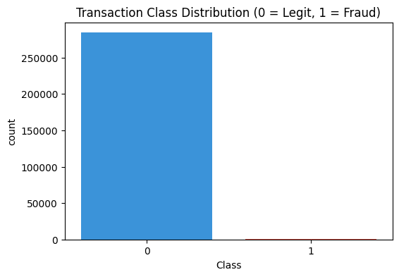
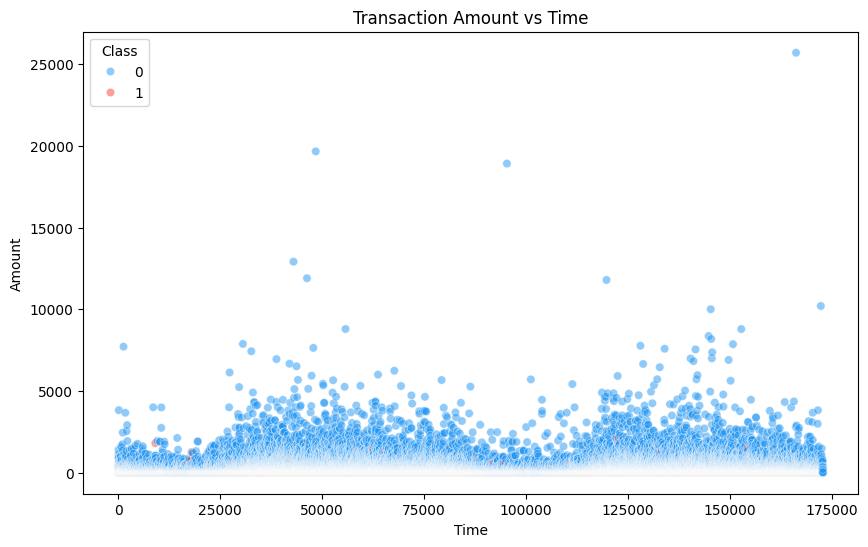
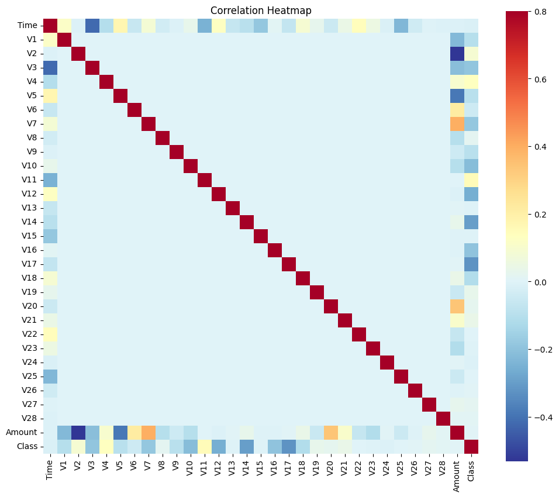

# Credit Card Fraud Detection

Machine learning project for detecting fraudulent credit card transactions using **K-Nearest Neighbors (KNN)** and **XGBoost**.

## 📌 Project Overview

Credit card fraud detection is a highly imbalanced classification problem because fraudulent transactions represent only a very small percentage of all transactions.

This project covers the complete machine learning workflow, including:

- Exploratory Data Analysis (EDA)
- Data quality checking
- Duplicate analysis
- Class imbalance analysis
- Feature correlation analysis
- Stratified train-test splitting
- Feature scaling for KNN
- KNN baseline model
- XGBoost classification
- Class imbalance handling
- Hyperparameter tuning
- Model evaluation and comparison

## 📊 Dataset

The project uses the Credit Card Fraud Detection dataset containing transactions made by European cardholders.

The dataset contains:

- **284,807 transactions**
- **31 columns**
- **30 input features**
- **1 target variable (`Class`)**

The target variable is highly imbalanced:

- `Class = 0` → Legitimate transaction
- `Class = 1` → Fraudulent transaction

The dataset is **not included in this repository** because of its file size.

To reproduce the project, download the dataset separately and place the CSV file in the location specified in the notebook.
## 🔍 Exploratory Data Analysis

### Transaction Class Distribution

The class distribution demonstrates the severe imbalance between legitimate and fraudulent transactions.



### Transaction Amount vs Time

Transaction amount and time were explored to identify possible patterns in transaction behavior.



### Correlation Heatmap

A correlation heatmap was used to examine relationships between numerical features and the target variable.



## 🤖 Machine Learning Models

### K-Nearest Neighbors (KNN)

KNN was implemented as a baseline classification model.

Since KNN is a distance-based algorithm, the features were standardized using `StandardScaler`.

A stratified subset of the training data was used for the KNN experiment.

### XGBoost

XGBoost was used as the primary tree-based classification model.

Because the dataset is highly imbalanced, `scale_pos_weight` was used to give greater importance to the minority fraud class.

XGBoost does not require feature scaling.

## ⚙️ Hyperparameter Tuning

XGBoost hyperparameters were optimized using:

- GridSearchCV
- RandomizedSearchCV

The models were evaluated using metrics suitable for imbalanced classification.

## 📈 Model Evaluation

The project evaluates models using:

- Accuracy
- Precision
- Recall
- F1-Score
- ROC-AUC
- PR-AUC

Accuracy alone is not sufficient for this problem because the dataset contains very few fraudulent transactions.

## 🛠️ Technologies Used

- Python
- Pandas
- NumPy
- Matplotlib
- Seaborn
- Scikit-learn
- XGBoost
- Google Colab

## 📁 Project Structure

```text
Credit-Card-Fraud-Detection/
│
├── Credit_Card_Fraud_Detection.ipynb
├── README.md
├── requirements.txt
│
└── images/
    ├── correlation_heatmap.png
    ├── transaction_amount_vs_time.png
    └── transaction_class_distribution.png

## 👤 Author

**Atul Kumar Anupam**

Data Analyst | Data Science & Machine Learning

- GitHub: [iamatulcs](https://github.com/iamatulcs)
- LinkedIn: [Atul Kumar Anupam](https://www.linkedin.com/in/atul-kumar-anupam/)
